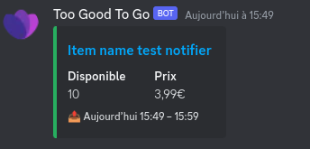
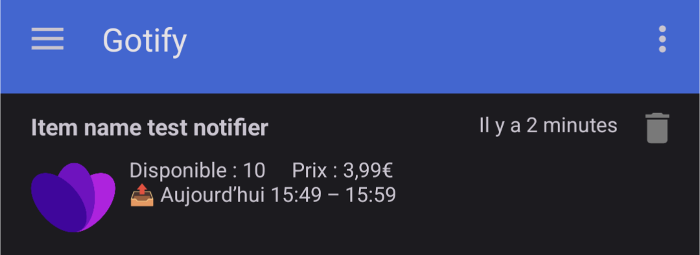
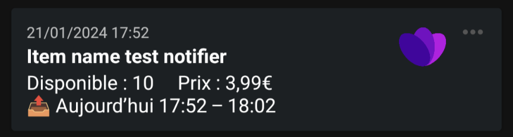
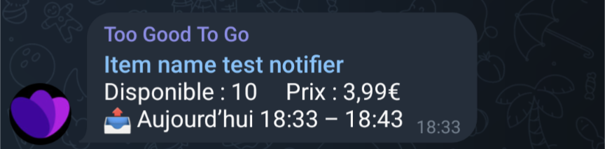
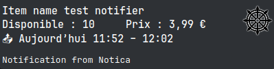

#  Too Good To Go - Notifier

Too Good To Go - Notifier monitors your favorite TGTG Store for newly available items.  
Supports multiple accounts and notifiers type (new type of notifiers will be added later).  
I made it for my personal use only, but it may also be usefully to someone else.

## Install

```zsh
git clone https://github.com/Nyrrell/tgtg-notifier.git
cd tgtg-notifier
```

## Configure

To run this project, you will need to create a `config.json` file, see below or use `example.config.json` to set your
configuration.


- Set global parameters if needed `timezone` (_default:_ UTC), `locale` (_default:_ en-US)
- To improve i18n, you can set `available` & `price` for translate in your language, it's totally optional.
- For each account, be sure to fill these fields `notifiers` and `email` (optionally `accessToken`
and `refreshToken` if you already have it).  

```json
{
  "accounts": [
    {
      "email": "Too Good To Go email",
      "accessToken": "Too Good To Go Access Token goes here if you have it",
      "refreshToken": "Too Good To Go Refresh Token goes here if you have it",
      "notifiers": [
        {
          "type": "discord",
          "webhookUrl": "https://discord.com/api/webhooks/123456789/ABCDEFG123456789"
        },
        {
          "type": "gotify",
          "apiUrl": "https://gotify.net",
          "token": "RFRNGDQmCgboyVF"
        }
      ]
    }
  ],
  "timezone": "Europe/Paris",
  "locale": "fr-FR",
  "language": {
    "available": "Disponible",
    "price": "Prix"
  },
  "cronSchedule": "*/5 6-22 * * *",
  "sendStartNotification": true,
  "testNotifiers": false,
  "logLevel": "info"
}
```

### Available notifiers configuration
> [!TIP]
> In global configuration you can set `testNotifiers` to `true`, the process will send test notifications with a fake item for all configured accounts then exit process.

<details>
<summary><b>DISCORD</b></summary>

- <b>type</b> : _string_ = `discord`
- <b>webhookUrl</b> : _string_ = `https://discord.com/api/webhooks/123456789/ABCDEFG123456789`
  - [How to create a webhook](https://support.discord.com/hc/en-us/articles/228383668-Intro-to-Webhooks)
</details>
<details>
<summary><b>GOTIFY</b></summary>

- <b>type</b> : _string_ = `gotify`
- <b>apiUrl</b> : _string_ = `https://gotify.net`
- <b>token</b> : _string_ = `RFRNGDQmCgboyVF`  
  - On the Gotify web UI, Apps > Create Application > reveal the token  
- <b>priority</b>? : _number_ = `10`
  - The priority level sent with the message (Default 5)
</details>
<details>
<summary><b>NTFY</b></summary>

- <b>type</b> : _string_ = `ntfy`
- <b>apiUrl</b> : _string_ = `https://ntfy.sh`
- <b>topic</b> : _string_ = `tgtg`
- <b>token</b>? : _string_ = `tk_AgQdq7mVBoFD37zQVN29RhuMzNIz2`
  - Optional if your server don't use it. [How to create a token](https://docs.ntfy.sh/config/#access-tokens)
- <b>priority</b>? : _number_ = `5`
  - The priority level sent with the message, range 1 - 5 (Default 3)
</details>
<details>
<summary><b>SIGNAL-CLI-REST-API</b></summary>

- <b>type</b> : _string_ = `signal`
- <b>apiUrl</b> : _string_ = `http://127.0.0.1:8080`
- <b>number</b> : _string_ = `+431212131491291`
  - Registered Phone Number
- <b>recipients</b> : _array\<string\>_ = `["group.ckRzaEd4VmRzNnJaASAEsasa", "+4912812812121"]`
  - Accept group-id and phone number
- <b>notifySelf</b>? : _boolean_ = `false`
  - Optional setting it to `false` will prevent your devices from generating a notification when you send a message yourself.

>Tested with [signal-cli-rest-api](https://github.com/bbernhard/signal-cli-rest-api) but [python-signal-cli-rest-api](https://gitlab.com/morph027/python-signal-cli-rest-api/) will work too, project documentation say :  
>_It is quite similar to bbernhard/signal-cli-rest-api, [...] i’m tempted to mimic bbernhard’s API routes as close as possible._
</details>
<details>
<summary><b>TELEGRAM</b></summary>

- <b>type</b> : _string_ = `telegram`
- <b>apiUrl</b>? : _string_ = `https://api.telegram.org`
  - Just in case url api is moved (optional)
- <b>token</b> : _string_ = `110201543:AAHdqTcvCH1vGWJxfSeofSAs0K5PALDsaw`
  - [How to create a bot and get your token](https://core.telegram.org/bots/features#botfather)
- <b>chatId</b> : _string_ | _number_ = `-100123456789`
  - Unique identifier for the target chat or username of the target channel
- **messageThreadId**? : _number_ = `6`
  - Unique identifier for the target message thread (topic) of the forum (optional)
</details>
<details>
<summary><b>NOTICA</b></summary>

- <b>type</b> : _string_ = `notica`
- <b>apiUrl</b> : _string_ = `https://notica.us`
- <b>room</b> : _string_ = `?abc123`
</details>

### Global configuration details
| Name                    | Default      | Description                                                                                                                     |
|-------------------------|--------------|---------------------------------------------------------------------------------------------------------------------------------|
| `timezone`              | `UTC`        | The time zone to use as UTC offsets                                                                                             |
| `locale`                | `en-US`      | Used to format dates and numbers in a form that's conventional for a specific language and region                               |
| `language.available`    | `Available`  | Translate 'Available' in your language                                                                                          |
| `language.price`        | `Price`      | Translate 'Price' in your language                                                                                              |
| `cronSchedule`          | `* * * * *`  | [Pattern](https://github.com/hexagon/croner?tab=readme-ov-file#pattern) used to specify monitoring execution                    |
| `sendStartNotification` | `true`       | Send a start notification when app start to monitor an account                                                                  |
| `testNotifiers`         | `false`      | Send a test notification with a fake item for all configured accounts then exit process                                         |
| `logLevel`              | `info`       | Log only if level is less than or equal to this [level](https://github.com/winstonjs/winston?tab=readme-ov-file#logging-levels) |

## Run

First you need to install [Node.js](https://nodejs.org/) 22.14.0 or higher

```zsh
npm install
npm run build
npm run start
```

If you don't set `accessToken` and `refreshToken` You should receive an email from Too Good To Go.<br>
You must validate the login by clicking the link inside this email within 2 minute (Do not use your phone if Too Good To
Go app is installed).<br>

After that `tgtg-notifier` start to monitor your favorite stores (once per minute) and send you a notification when a
store's stock is add.

## Run with docker

A Dockerfile is available in the repository to build a ready-to-run Docker image.<br>
You need to map the volumes to use your `config.json` file and a folder for the application's `logs`.

```zsh
docker build -t tgtg-notifier .
docker run --name tgtg-notifier -d -v ./config.json:/usr/app/config.json -v ./logs/:/usr/app/logs tgtg-notifier-app
```

If you prefer to use Docker Compose, a `docker-compose.yml` configuration file is also available.

```zsh
docker-compose up -d
```

## Running with Podman Quadlet

You will need to create two configuration files in your Systemd user directory : `~/.config/containers/systemd/`

### 1\. Container File: `tgtg-notifier.container`
```ini
[Unit]
Description=TGTG Notifier

# Dependency on the build unit to ensure the image exists before starting the container.
Requires=tgtg-notifier.service
After=tgtg-notifier.service

[Container]
ContainerName=tgtg-notifier
Image=tgtg-notifier.build

# The volume mounts the config.json file as read-only (ro).
Volume=%h/tgtg-notifier/config.json:/usr/app/config.json:ro

[Service]
Restart=always
RestartSec=30

[Install]
WantedBy=default.target
```

### 2\. Image Build File: `tgtg-notifier.build`
```ini
[Build]
ImageTag=localhost/tgtg-notifier:latest
SetWorkingDirectory=https://github.com/Nyrrell/tgtg-notifier.git
```

Finally, reload Systemd and start the container:

```zsh
systemctl --user daemon-reload
systemctl --user start tgtg-notifier.service
```

### Notification example
<details><summary><b>DISCORD</b></summary>


</details>
<details><summary><b>GOTIFY</b></summary>


</details>
<details><summary><b>NTFY</b></summary>


</details>
<details><summary><b>SIGNAL-CLI-REST-API</b></summary>


</details>
<details><summary><b>TELEGRAM</b></summary>


</details>
<details><summary><b>NOTICA</b></summary>


</details>
