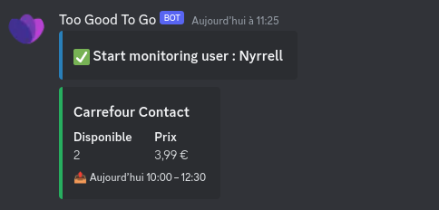

#  Too Good To Go - Notifier

Too Good To Go - Notifier monitors your favorite TGTG Store for newly available items and notifies you with a Discord's
notification.<br>
I made it for my personal use only, but it may also be usefully to someone else.

## Install

```zsh
git clone https://github.com/Nyrrell/tgtg-notifier.git
cd tgtg-notifier
npm install
npm run build
```

## Configure

To run this project, you will need to create a `config.json` file, see below or use `example.config.json` to set your
configuration.

Be sure to fill these fields `Webhook`, `Name`, `Timezone`, `Locale`, `Email` (or `User-ID`, `Access-Token`
and `Refresh-Token` instead
of `Email`).<br>

```json
{
  "Users": [
    {
      "Name": "User 1",
      "Email": "Too Good To Go Email User 1",
      "User-ID": "Too Good To Go User ID goes here if you have it",
      "Access-Token": "Too Good To Go Access Token goes here if you have it",
      "Refresh-Token": "Too Good To Go Refresh Token goes here if you have it",
      "Favorite": true,
      "Webhook": "https://discord.com/api/webhooks/123456789/ABCDEFG123456789"
    }
  ],
  "Timezone": "Europe/Paris",
  "Locale": "fr-FR",
  "Language": {
    "Available": "Disponible",
    "Price": "Prix"
  }
}
```

- To improve i18n, you can set `Available` & `Price` for translate in your language, it's totally optional.

## Run

```zsh
npm run start
```

If you don't set `User-ID`, `Access-Token` and `Refresh-Token` You should receive an email from Too Good To Go.<br>
You must validate the login by clicking the link inside this email within 2 minute (Do not use your phone if Too Good To
Go app is installed).<br>

After that `tgtg-notifier` start to monitor your favorite stores (once per minute) and send you a notification when a
store's stock is add.

