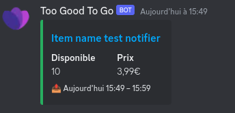
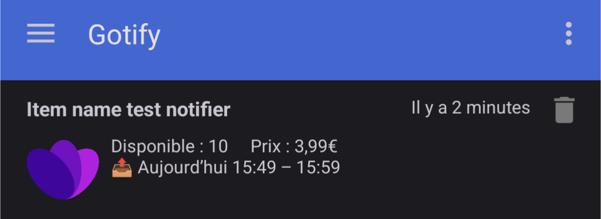
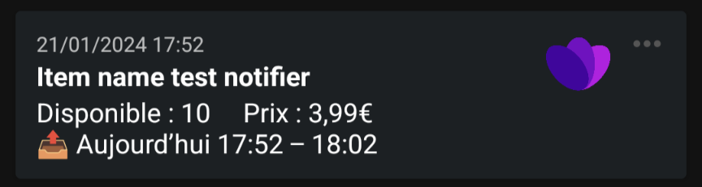
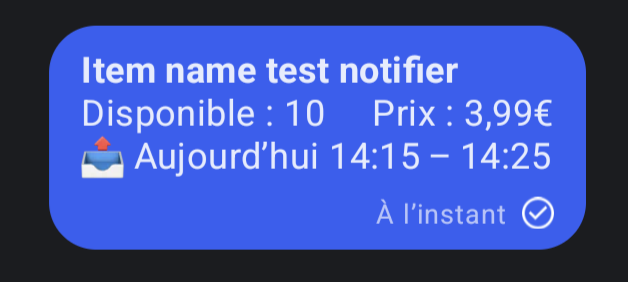
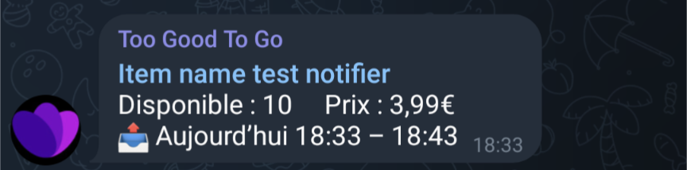
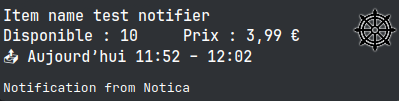

#  Too Good To Go - Notifier

Too Good To Go - Notifier monitors your favorite TGTG Store for newly available items.  
Supports multiple accounts and notifiers type (new type of notifiers will be added later).  
I made it for my personal use only, but it may also be useful to someone else.

---
> [!NOTE]
> The DataDome anti-bot cookie handling in this project is based on the work done in
> [Der-Henning/tgtg](https://github.com/Der-Henning/tgtg).

## Install

```zsh
git clone https://github.com/Nyrrell/tgtg-notifier.git
cd tgtg-notifier
```

## Configure

To run this project, you will need to create a `config.json` file, see below or use `example.config.json` to set your
configuration.

- Set global parameters if needed `timezone` (*default:* UTC), `locale` (*default:* en-US)
- To improve i18n, you can set `available` & `price` for translate in your language, it's totally optional.
- For each account, be sure to fill these fields `notifiers` and `email` (optionally `accessToken`
  and `refreshToken` if you already have it).

```json
{
  "accounts": [
    {
      "email": "Too Good To Go email",
      "accessToken": "Too Good To Go Access Token goes here if you have it",
      "refreshToken": "Too Good To Go Refresh Token goes here if you have it",
      "notifiers": [
        {
          "type": "discord",
          "webhookUrl": "https://discord.com/api/webhooks/123456789/ABCDEFG123456789"
        },
        {
          "type": "gotify",
          "apiUrl": "https://gotify.net",
          "token": "RFRNGDQmCgboyVF"
        }
      ]
    }
  ],
  "timezone": "Europe/Paris",
  "locale": "fr-FR",
  "language": {
    "available": "Disponible",
    "price": "Prix"
  },
  "cronSchedule": "*/5 6-22 * * *",
  "sendStartNotification": true,
  "testNotifiers": false,
  "logLevel": "info"
}
```

### Available notifiers configuration

> [!TIP]
> In global configuration you can set `testNotifiers` to `true`, the process will send test notifications with a fake
> item for all configured accounts then exit process.

<details>
<summary><b>DISCORD</b></summary>

- **type** : *string* = `discord`
- **webhookUrl** : *string* = `https://discord.com/api/webhooks/123456789/ABCDEFG123456789`
    - [How to create a webhook](https://support.discord.com/hc/en-us/articles/228383668-Intro-to-Webhooks)

</details>

<details>
<summary><b>GOTIFY</b></summary>

- **type** : *string* = `gotify`
- **apiUrl** : *string* = `https://gotify.net`
- **token** : *string* = `RFRNGDQmCgboyVF`
    - On the Gotify web UI, Apps > Create Application > reveal the token
- **priority**? : *number* = `10`
    - The priority level sent with the message (Default 5)

</details>

<details>
<summary><b>NTFY</b></summary>

- **type** : *string* = `ntfy`
- **apiUrl** : *string* = `https://ntfy.sh`
- **topic** : *string* = `tgtg`
- **token**? : *string* = `tk_AgQdq7mVBoFD37zQVN29RhuMzNIz2`
    - Optional if your server don't use it. [How to create a token](https://docs.ntfy.sh/config/#access-tokens)
- **priority**? : *number* = `5`
    - The priority level sent with the message, range 1 - 5 (Default 3)

</details>

<details>
<summary><b>SIGNAL-CLI-REST-API</b></summary>

- **type** : *string* = `signal`
- **apiUrl** : *string* = `http://127.0.0.1:8080`
- **number** : *string* = `+431212131491291`
    - Registered Phone Number
- **recipients** : *array\<string\>* = `["group.ckRzaEd4VmRzNnJaASAEsasa", "+4912812812121"]`
    - Accept group-id and phone number
- **notifySelf**? : *boolean* = `false`
    - Optional setting it to `false` will prevent your devices from generating a notification when you send a message
      yourself.

> Tested with [signal-cli-rest-api](https://github.com/bbernhard/signal-cli-rest-api)
> but [python-signal-cli-rest-api](https://gitlab.com/morph027/python-signal-cli-rest-api/) will work too.
</details>

<details>
<summary><b>TELEGRAM</b></summary>

- **type** : *string* = `telegram`
- **apiUrl**? : *string* = `https://api.telegram.org`
    - Just in case url api is moved (optional)
- **token** : *string* = `110201543:AAHdqTcvCH1vGWJxfSeofSAs0K5PALDsaw`
    - [How to create a bot and get your token](https://core.telegram.org/bots/features#botfather)
- **chatId** : *string* | *number* = `-100123456789`
    - Unique identifier for the target chat or username of the target channel
- **messageThreadId**? : *number* = `6`
    - Unique identifier for the target message thread (topic) of the forum (optional)

</details>

<details>
<summary><b>NOTICA</b></summary>

- **type** : *string* = `notica`
- **apiUrl** : *string* = `https://notica.us`
- **room** : *string* = `?abc123`

</details>

### Global configuration details

Configuration can be provided via:

1. Environment variables (**highest priority**)
2. `config.json`

| Name                    | Env Variable                   | Default     | Description                                                                                                                     |
|-------------------------|--------------------------------|-------------|---------------------------------------------------------------------------------------------------------------------------------|
| `timezone`              | `TGTG_TIMEZONE`                | `UTC`       | The time zone to use as UTC offsets                                                                                             |
| `locale`                | `TGTG_LOCALE`                  | `en-US`     | Used to format dates and numbers in a form that's conventional for a specific language and region                               |
| `language.available`    | `TGTG_STOCK`                   | `Available` | Translation for 'Available'                                                                                                     |
| `language.price`        | `TGTG_PRICE`                   | `Price`     | Translation for 'Price'                                                                                                         |
| `cronSchedule`          | `TGTG_CRON_SCHEDULE`           | `* * * * *` | [Pattern](https://github.com/hexagon/croner?tab=readme-ov-file#pattern) used to specify monitoring execution                    |
| `sendStartNotification` | `TGTG_SEND_START_NOTIFICATION` | `true`      | Send a start notification when app starts monitoring an account                                                                 |
| `testNotifiers`         | `TGTG_TEST_NOTIFIERS`          | `false`     | Send a test notification with a fake item for all configured accounts then exit process                                         |
| `logLevel`              | `TGTG_LOG_LEVEL`               | `info`      | Log only if level is less than or equal to this [level](https://github.com/winstonjs/winston?tab=readme-ov-file#logging-levels) |
| `port`                  | `TGTG_PORT`                    | `3000`      | Port used by the HTTP server to prompt the PIN code                                                                             |

## Run
First you need to install [Node.js](https://nodejs.org/) 22.14.0 or higher

```zsh
npm install
npm run build
npm run start
```

### First login — PIN code

If you don't set `accessToken` and `refreshToken`, Too Good To Go will send you an email containing a **PIN code**.

> [!IMPORTANT]
> Do **not** click the login link in the email — use the PIN code instead.  
> The magic link in the email only works on mobile.

Enter the PIN code when prompted, a small HTTP server starts automatically. Check the logs for a line like:

  ```
  Enter your PIN here → http://localhost:3000
  ```

Open that URL in your browser, paste the PIN, and click OK. The container will then complete the login and start
monitoring.

Once logged in, the `accessToken` and `refreshToken` are saved automatically. You can copy them into `config.json` to
skip the login step on future restarts.

After that, `tgtg-notifier` starts monitoring your favorite stores and sends you a notification whenever stock becomes
available.

## Run with Docker

A Dockerfile is available in the repository to build a ready-to-run Docker image.  
You need to map the volumes to use your `config.json` file and a folder for the application's `logs`.

```zsh
docker build -t tgtg-notifier .
docker run --name tgtg-notifier -d \
  -p 3000:3000 \
  -v ./config.json:/usr/app/config.json \
  -v ./logs/:/usr/app/logs \
  tgtg-notifier
```

Make sure port `3000` is exposed.

You can also customize the port via the `PORT` environment variable or config.json.

If you prefer to use Docker Compose, a `docker-compose.yml` configuration file is also available.

```zsh
docker-compose up -d
```

## Running with Podman Quadlet

You will need to create two configuration files in your Systemd user directory : `~/.config/containers/systemd/`

### 1. Container File: `tgtg-notifier.container`

```ini
[Unit]
Description=TGTG Notifier

Requires=tgtg-notifier.build
After=tgtg-notifier.build

[Container]
ContainerName=tgtg-notifier
Image=tgtg-notifier.build

PublishPort=3000:3000

Volume=%h/tgtg-notifier/config.json:/usr/app/config.json:ro

[Service]
Restart=always
RestartSec=30

[Install]
WantedBy=default.target
```

### 2. Image Build File: `tgtg-notifier.build`

```ini
[Build]
ImageTag=localhost/tgtg-notifier:latest
SetWorkingDirectory=https://github.com/Nyrrell/tgtg-notifier.git
```

Finally, reload Systemd and start the container:

```zsh
systemctl --user daemon-reload
systemctl --user start tgtg-notifier.service
```

### Notification examples

<details><summary><b>DISCORD</b></summary>


</details>
<details><summary><b>GOTIFY</b></summary>


</details>
<details><summary><b>NTFY</b></summary>


</details>
<details><summary><b>SIGNAL-CLI-REST-API</b></summary>


</details>
<details><summary><b>TELEGRAM</b></summary>


</details>
<details><summary><b>NOTICA</b></summary>


</details>
