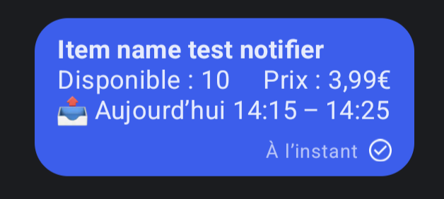

#  Too Good To Go - Notifier

Too Good To Go - Notifier monitors your favorite TGTG Store for newly available items.  
Supports multiple accounts and notifiers type (new type of notifiers will be added later).  
I made it for my personal use only, but it may also be usefully to someone else.

## Install

```zsh
git clone https://github.com/Nyrrell/tgtg-notifier.git
cd tgtg-notifier
npm install
npm run build
```

## Configure
> [!WARNING]
> Be cautious if you are already using **Too Good To Go - Notifier**.  
> The latest release has caused significant changes in configuration file.

To run this project, you will need to create a `config.json` file, see below or use `example.config.json` to set your
configuration.


- Set global parameters if needed `timezone` (_default:_ UTC), `locale` (_default:_ en-US)
- To improve i18n, you can set `available` & `price` for translate in your language, it's totally optional.
- For each account, be sure to fill these fields `notifiers` and `email` (optionally `userId`, `accessToken`
and `refreshToken` if you already have it).  

```json
{
  "accounts": [
    {
      "email": "Too Good To Go email",
      "userId": "Too Good To Go User ID goes here if you have it",
      "accessToken": "Too Good To Go Access Token goes here if you have it",
      "refreshToken": "Too Good To Go Refresh Token goes here if you have it",
      "notifiers": [
        {
          "type": "discord",
          "webhookUrl": "https://discord.com/api/webhooks/123456789/ABCDEFG123456789"
        },
        {
          "type": "gotify",
          "apiUrl": "https://gotify.net",
          "token": "RFRNGDQmCgboyVF"
        }
      ]
    }
  ],
  "timezone": "Europe/Paris",
  "locale": "fr-FR",
  "language": {
    "available": "Disponible",
    "price": "Prix"
  },
  "testNotifiers": false
}
```

### Available notifiers configuration
> [!TIP]
> In global configuration you can set `testNotifiers` to `true`, the process will send test notifications with a fake item for all configured accounts then exit process.

<details>
<summary><b>DISCORD</b></summary>

- <b>type</b> : _string_ = `discord`
- <b>webhookUrl</b> : _string_ = `https://discord.com/api/webhooks/123456789/ABCDEFG123456789`
  - [How to create a webhook](https://support.discord.com/hc/en-us/articles/228383668-Intro-to-Webhooks)
</details>
<details>
<summary><b>GOTIFY</b></summary>

- <b>type</b> : _string_ = `gotify`
- <b>apiUrl</b> : _string_ = `https://gotify.net`
- <b>token</b> : _string_ = `RFRNGDQmCgboyVF`  
  - On the Gotify web UI, Apps > Create Application > reveal the token  
- <b>priority</b>? : _number_ = `10`
  - The priority level sent with the message (Default 5)
</details>
<details>
<summary><b>SIGNAL-CLI-REST-API</b></summary>

- <b>type</b> : _string_ = `signal`
- <b>apiUrl</b> : _string_ = `http://127.0.0.1:8080`
- <b>number</b> : _string_ = `+431212131491291`
  - Registered Phone Number
- <b>recipients</b> : _array\<string\>_ = `["group.ckRzaEd4VmRzNnJaASAEsasa", "+4912812812121"]`
  - Accept group-id and phone number

>Tested with [signal-cli-rest-api](https://github.com/bbernhard/signal-cli-rest-api) but [python-signal-cli-rest-api](https://gitlab.com/morph027/python-signal-cli-rest-api/) will work too, project documentation say :  
>_It is quite similar to bbernhard/signal-cli-rest-api, [...] i’m tempted to mimic bbernhard’s API routes as close as possible._
</details>

## Run

```zsh
npm run start
```

If you don't set `userId`, `accessToken` and `refreshToken` You should receive an email from Too Good To Go.<br>
You must validate the login by clicking the link inside this email within 2 minute (Do not use your phone if Too Good To
Go app is installed).<br>

After that `tgtg-notifier` start to monitor your favorite stores (once per minute) and send you a notification when a
store's stock is add.

### Notification example
<details>
<summary><b>DISCORD</b></summary>


</details>
<details>
<summary><b>GOTIFY</b></summary>


</details>
<details>
<summary><b>SIGNAL-CLI-REST-API</b></summary>


</details>
